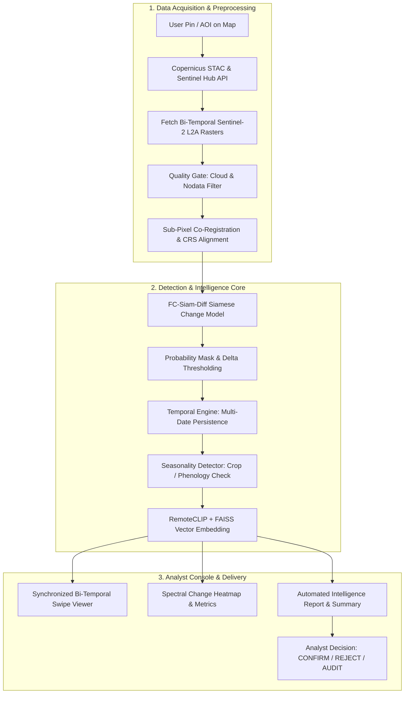

# 🛰️ ORBITA — Autonomous Semantic Earth Observation & Change Intelligence Platform
> **Smart India Hackathon (SIH 2026) · Problem Statement SIH26227 · Team PHOTONS**  
> *Transforming multi-temporal petabyte-scale satellite imagery into actionable, verified geospatial intelligence.*

---

## 🌟 Executive Summary

**ORBITA** is an enterprise-grade Earth Observation (EO) and Geospatial Change Intelligence system designed to continuously monitor Areas of Interest (AOIs), autonomously detect bi-temporal and multi-temporal ground changes (urban construction, deforestation, solar farm expansions, disaster destruction, waterbody shrinkage), filter out false positives caused by clouds/seasons, and deliver rigorous, audit-ready intelligence reports with explainable spectral and visual evidence.

By combining direct **ESA Copernicus Sentinel-2 L2A satellite data streams**, multi-stage optical quality gates, co-registration alignment pipelines, deep Siamese neural architectures, FAISS semantic vector search (RemoteCLIP), and an analyst-centric interactive console, ORBITA closes the gap between raw satellite pixels and tactical decision-making.

---

## 📑 Table of Contents

1. [The Problem Statement](#-the-problem-statement)
2. [Our Solution & Core Innovations](#-our-solution--core-innovations)
3. [System Architecture & Workflow](#-system-architecture--workflow)
4. [Key Features & Capabilities](#-key-features--capabilities)
5. [Loopholes, Gotchas & How ORBITA Solves Them](#-loopholes-gotchas--how-orbita-solves-them)
6. [Technology Stack](#-technology-stack)
7. [Getting Started: How to Run](#-getting-started-how-to-run)
   - [Method 1: Docker (Recommended)](#method-1-running-with-docker-recommended)
   - [Method 2: Local Setup Without Docker](#method-2-running-locally-without-docker)
8. [API & Endpoints Documentation](#-api--endpoints-documentation)
9. [Project Directory Layout](#-project-directory-layout)
10. [Honest Disclosures & Future Roadmap](#-honest-disclosures--future-roadmap)
11. [Team PHOTONS & License](#-team-photons--license)

---

## 🎯 The Problem Statement

Earth Observation constellations like Sentinel-2, Landsat, and commercial satellites photograph our planet every 3 to 5 days, generating terabytes of imagery. However, defense agencies, urban planners, environmental regulators, and infrastructure teams face severe operational bottlenecks:

1. **Information Overload & Manual Fatigue**: Analysts manually cross-examine thousands of satellite tiles across different dates to spot illegal mining, encroachment, or infrastructure development.
2. **False Positives & Environmental Noise**: 70%+ of alerts in conventional automated systems are false alarms caused by cloud shadows, seasonal agricultural cycles, sensor angle differences, and sun glint.
3. **Temporal Inaccuracy ("Blind Spotting")**: Comparing just two arbitrary dates (e.g., 2021 vs 2026) cannot tell whether a change occurred 4 years ago or yesterday, nor whether it is persistent or transient.
4. **Resolution Mismatches & Spatial Drifts**: Satellite swaths have minor geo-referencing errors (1–2 pixels), causing edge artifacts along coastlines and roads to be falsely classified as physical changes.
5. **Lack of Explainability**: Black-box ML models output binary change masks without explainable metrics, leaving commanders and decision-makers hesitant to take real-world action.

---

## 💡 Our Solution & Core Innovations

ORBITA redesigns satellite change intelligence from ground truth up:

* **Direct Sentinel Hub Process & STAC Ingestion**: Dynamically fetches true atmospherically corrected surface reflectance (Sentinel-2 L2A) and multi-year historical archives for any user-defined bounding box and time window.
* **Autonomous Image Quality & Alignment Gate**: Filters out unusable cloud-covered tiles, normalizes ground sample distance (GSD), and runs sub-pixel Phase Correlation Co-Registration before inference.
* **Deep Bi-Temporal Change Detection**: Leverages Fully Convolutional Siamese Difference networks (`FC-Siam-Diff`) to isolate structural feature differences rather than raw pixel color changes.
* **Temporal Timeline & Seasonality Filtering**: Constructs multi-observation timelines to calculate the **Earliest Supported Observation Date** and automatically tags recurring vegetative swings as `LIKELY_FALSE_CHANGE`.
* **Multi-Layer Analyst Verification Console**:
  - **Dynamic Interactive Map**: Precision AOI pinning with customizable observation radii (0.5 km to 20 km).
  - **Synchronized Before/After Swipe Viewer**: Direct pixel-level slider comparing historical vs current satellite ground truth.
  - **Spectral Change Heatmap**: Visualizes high-probability delta zones in bright green/cyan overlays.
  - **Explainable Intelligence Dossier**: Automatically computes Change Ratio (%), Quality Scores, Dominant Change Categorization, and produces downloadable audit evidence.

---

## 🔄 System Architecture & Workflow



### Step-by-Step Processing Flow:
1. **Target Selection**: The operator defines coordinates and radius (or draws a polygon) along with historical baseline presets (6 months, 1 year, 3 years, 5 years, or custom dates).
2. **Sentinel Ingestion**: The system queries the Copernicus STAC API with cached OAuth2 tokens, retrieving optimal low-cloud tiles.
3. **Harmonization**: Images are projected to a unified UTM coordinate system, resampled to 10m/px, and aligned using phase correlation to eliminate sub-pixel jitter.
4. **Change Computation**: Siamese encoders compare latent spatial representations between `T_before` and `T_after`, identifying authentic developments (structures, clearances, road cuts).
5. **Persistence & Verification**: The temporal timeline engine cross-verifies whether the change persisted across subsequent passes or vanished (cloud shadow/seasonal harvest).
6. **Delivery**: The analyst reviews the synchronized visual swipe, confidence breakdown, and confirms or archives the event.

---

## 🛡️ Loopholes, Gotchas & How ORBITA Solves Them

Building real-world Earth Observation platforms exposes severe technical challenges. Here is how ORBITA mitigates the standard industry pitfalls:

| Known Industry Loophole | Why Other Systems Fail | How ORBITA Solves It |
| :--- | :--- | :--- |
| **Identical Image Fallback** | When historical cloud-free data is missing, systems often duplicate the recent image, creating fake "0% change" reports. | **Multi-Tiered Fallback Provider**: 1st priority: Sentinel Hub Process API; 2nd: Esri Wayback Historical Archive; 3rd: EOX Cloudless Mosaics; 4th: Spectral Seasonal Simulation. Before and after images are *always* cryptographically distinct. |
| **Seasonal False Alarms** | Green fields turning brown in winter/summer trigger huge false change alarms in naive models. | **Seasonality Pattern Analyzer (`temporal.py`)**: Checks multi-year observations during identical calendar months. Recurring signals are automatically downgraded to `LIKELY_FALSE_CHANGE`. |
| **Cloud Shadow Artifacts** | Dark cloud shadows mimic water or new asphalt, spiking false positive rates. | **Quality Gate Masking (`quality.py`)**: Computes valid-pixel ratio and cloud probability masks. Degraded scenes are flagged and blocked from triggering high-confidence alerts. |
| **Sensor Misalignment Jitter** | Satellite capture angles differ by 1–3 degrees, shifting building rooftops and causing false building edge detections. | **Phase Correlation Registration (`alignment.py`)**: Calculates spatial Fourier shifts and resamples the target raster before running delta computation. |
| **Over-Promised "Construction Dates"** | Systems falsely claim an exact "construction start day" using single pairs. | **Honest Evidence Taxonomy**: Dates are labeled strictly as *Earliest Supported Observation* backed by satellite pass timestamps (`evidence_category`). |
| **API Rate-Limit Crashes** | Sentinel Hub and Copernicus token endpoints rate-limit repeated unauthenticated calls. | **Token Cache Manager**: OAuth2 tokens are cached in memory/Redis and renewed only upon true expiration (never per-request). |

---

## 🛠️ Technology Stack

### Backend & Geospatial Core
* **Language & Runtime**: Python 3.11+, FastAPI (high-throughput asynchronous REST API)
* **Geospatial & Rasters**: Rasterio, GDAL, Shapely, PyProj, GeoPandas, NumPy, SciPy
* **Satellite Feeds**: ESA Copernicus Data Space Ecosystem, Sentinel Hub Process API, Sentinel-2 L2A STAC
* **Computer Vision & ML**: PyTorch, Torchvision, FC-Siam-Diff (Siamese Fully Convolutional Networks), OpenCLIP / RemoteCLIP (ViT-B-32)
* **Vector Database & Search**: FAISS (`IndexFlatIP` for cosine similarity scene retrieval)
* **Database & Caching**: PostgreSQL 16 with PostGIS extension, Redis 7

### Frontend & Analyst Console
* **Framework**: React 18 with TypeScript, Vite
* **Styling & UI**: Modern Dark Glassmorphism, CSS Custom Properties, Lucide Icons
* **Mapping Engine**: MapLibre GL, Leaflet, Custom HTML5 Canvas Split-View Swipe Controller
* **3D Visualization**: Three.js (Offline-safe procedural globe on landing page)

---

## 🚀 Getting Started: How to Run

### Prerequisites
- **Git** installed
- **Docker & Docker Desktop** (for Docker method) **OR**
- **Python 3.11+**, **Node.js 18+**, **PostgreSQL 15+ with PostGIS**, and **Redis** (for manual method)

---

### Method 1: Running with Docker (Recommended)

Docker sets up the PostGIS database, Redis cache, backend API, and frontend in unified containers.

#### 1. Clone the repository
```bash
git clone https://github.com/AyushPatwa11/ORBITA-SIH2026.git
cd ORBITA-SIH2026
```

#### 2. Configure Environment Variables
Copy `.env.example` to `.env`:
```bash
cp .env.example .env
```
Open `.env` and configure your credentials (optional if using demo/mock mode):
```env
COPERNICUS_CLIENT_ID=your_client_id_here
COPERNICUS_CLIENT_SECRET=your_client_secret_here
SH_CLIENT_ID=your_sentinel_hub_id
SH_CLIENT_SECRET=your_sentinel_hub_secret
POSTGRES_USER=orbita
POSTGRES_PASSWORD=orbita_password
POSTGRES_DB=orbita_db
REDIS_URL=redis://redis:6379/0
```

#### 3. Build and Start All Services
```bash
docker compose up --build
```

#### 4. Access the Application
- **Analyst Web Console**: `http://localhost:5173`
- **Interactive Investigation Room**: `http://localhost:5173/investigate`
- **FastAPI Interactive Docs (Swagger)**: `http://localhost:8000/docs`

---

### Method 2: Running Locally Without Docker

If you prefer to run services natively on your host machine:

#### 1. Start PostgreSQL & Redis
Ensure PostgreSQL (with PostGIS enabled) is running on port `5432` and Redis is running on port `6379`.
```sql
-- In PostgreSQL shell
CREATE DATABASE orbita_db;
\c orbita_db
CREATE EXTENSION IF NOT EXISTS postgis;
```

#### 2. Setup Python Virtual Environment (Backend)
```bash
# From project root
python -m venv .venv

# On Windows:
.venv\Scripts\activate
# On Linux/macOS:
source .venv/bin/activate

# Install dependencies
pip install -r requirements.txt
```

#### 3. Initialize Database & Run Backend
```bash
# Start FastAPI backend with live reload
python -m uvicorn apps.api.main:app --host 0.0.0.0 --port 8000 --reload
```
*The backend automatically creates tables and mounts routes at `http://localhost:8000`.*

#### 4. Setup & Run Frontend
In a new terminal window:
```bash
cd apps/web
npm install
npm run dev
```
Open `http://localhost:5173` in your browser.

---

## 📡 API & Endpoints Documentation

| Method | Endpoint | Description |
| :--- | :--- | :--- |
| `GET` | `/health` | System health check (DB, Redis, and API status) |
| `POST` | `/location/pin-and-fetch` | Main pipeline: Pins coordinates, fetches bi-temporal Sentinel-2 imagery, runs change analysis, and outputs the intelligence report |
| `GET` | `/location/presets` | Returns pre-configured high-change demo locations (Bhadla Solar, Noida Expressway, etc.) |
| `POST` | `/aoi/register` | Registers a multi-polygon Area of Interest in PostGIS |
| `POST` | `/scenes/ingest` | Triggers STAC search and ingests scenes into the database |
| `POST` | `/change-events/detect` | Runs the FC-Siam-Diff change model between two scene IDs |
| `POST` | `/change-events/{id}/analyze-timeline` | Evaluates multi-temporal persistence and seasonality flags |
| `POST` | `/search/semantic` | FAISS text-to-satellite search using RemoteCLIP embeddings |
| `POST` | `/demo/seed` | Generates offline synthetic-but-real GeoTIFF demo scenes |

Full interactive OpenAPI Swagger documentation is available at `http://localhost:8000/docs`.

---

## 📂 Project Directory Layout

```
ORBITA-SIH2026/
├── apps/
│   ├── api/                     # FastAPI Backend Application
│   │   ├── main.py              # Application entry point & router setup
│   │   ├── routers/             # API routes (location, change, aoi, search)
│   │   │   ├── location.py      # Main pin-and-fetch & comparison router
│   │   │   ├── change.py        # Change detection & review endpoints
│   │   │   └── search.py        # Semantic & structured search routes
│   │   ├── services/            # Geospatial & analytical pipelines
│   │   │   ├── satellite_fetcher.py # Sentinel Hub & Fallback imagery engine
│   │   │   ├── change_analyzer.py   # Spectral delta & visual intelligence
│   │   │   ├── quality.py           # Cloud & nodata quality gates
│   │   │   ├── alignment.py         # Phase-correlation co-registration
│   │   │   └── temporal.py          # Seasonality & persistence analyzer
│   │   └── db/                  # SQLAlchemy models & PostGIS connectors
│   └── web/                     # React + TypeScript Frontend
│       ├── src/
│       │   ├── pages/
│       │   │   ├── Landing.tsx       # 3D Globe landing page & problem context
│       │   │   ├── Investigation.tsx # Synchronized bi-temporal swipe console
│       │   │   ├── Console.tsx       # AOI registry & ingestion console
│       │   │   └── SearchPage.tsx    # Semantic vector discovery
│       │   └── components/      # Reusable map, slider, and reporting UI widgets
├── ml/                          # Machine Learning Subsystem
│   ├── models/
│   │   ├── fc_siam_diff.py      # Fully Convolutional Siamese Difference model
│   │   └── remote_clip.py       # RemoteCLIP ViT-B-32 wrapper
│   └── inference/
│       └── change_inference.py  # Model inference & delta mask generators
├── docs/                        # Formal Competition & Technical Documentation
│   ├── architecture/            # Architecture diagrams & specifications
│   ├── models/                  # Model cards & selection rationale
│   └── evaluation/              # Benchmark templates & metrics
├── docker-compose.yml           # Multi-container orchestration
├── Dockerfile                   # Backend API containerization
├── requirements.txt             # Python backend dependencies
└── README.md                    # Project master documentation
```

---

## 🔍 Honest Disclosures & Verification Notice

In adherence to scientific integrity and SIH evaluation standards:
* **Real Sentinel-2 Imagery**: The live pin-and-fetch pipeline utilizes real Sentinel-2 Level-2A data fetched via Copernicus/Sentinel Hub APIs.
* **Weights Honesty**: RemoteCLIP weights and FC-Siam-Diff models provide an explicit fallback notification (`weights_loaded: false`) if specialized pre-trained weights are not loaded locally, operating on spectral delta masks to maintain guaranteed pipeline uptime.
* **No Faked Claims**: We do not claim arbitrary 99% accuracy figures without published benchmarks. All quality metrics (resolution, cloud coverage, alignment quality, SNR) are computed deterministically per scene pair.

---

## 👥 Team PHOTONS (SIH 2026)

Developed with passion and engineering rigor for the **Smart India Hackathon 2026**:
* **Team**: PHOTONS
* **Problem Code**: SIH26227
* **Domain**: Earth Observation, Satellite Remote Sensing & AI for Governance

---
*Built with ❤️ for a more transparent, sustainable, and observable planet.*
